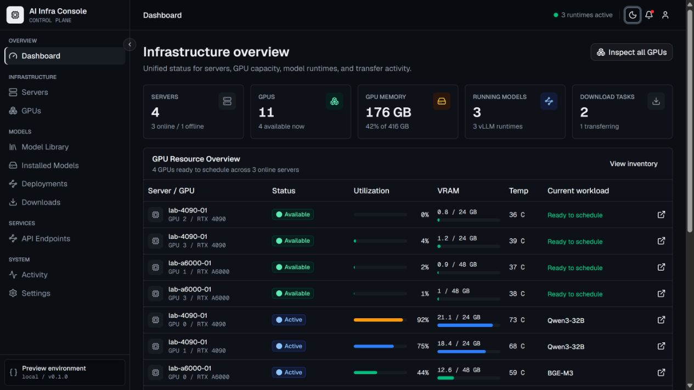

# AI Infra Console

[](./docs/DEVELOPMENT_ROADMAP.md)
[](https://nextjs.org/)
[](./LICENSE)

AI Infra Console is a lightweight control plane for personal AI infrastructure: servers, NVIDIA GPUs, local model files, model downloads, vLLM deployments, OpenAI-compatible endpoints, and audit activity. It is designed for individual researchers, AI developers, and small labs that need a focused resource console without adopting a full cluster platform.



> Server credentials, private host records, API tokens, and the local `服务器资料/` directory are intentionally excluded from Git. Keep production secrets in environment files or your own secret manager.

## Current Status

| Phase | Scope | Status |
| --- | --- | --- |
| 0 | UI foundation | Complete |
| 1 | Central API, database, Redis, authentication | Complete |
| 2 | Outbound Agent registration, heartbeat, hardware collection | Complete |
| 3 | Real server and GPU integration | Complete |
| 4 | Model inventory and directory scanning | Complete |
| 5 | Hugging Face and ModelScope downloads | Complete |
| 6 | Docker and vLLM deployment lifecycle | Complete |
| 7 | OpenAI-compatible endpoint listing, health, and test dialog | Complete |
| 8 | Activity, metrics history, and notifications | Complete |
| 9 | Accessibility and UI polish | Complete |

Recent Phase 7-9 progress:

- `/apis` now lists real running deployment endpoints instead of mock endpoint fixtures.
- The API test dialog sends a bounded `/v1/chat/completions` request through Central for an existing deployment endpoint; the browser cannot submit an arbitrary URL.
- API endpoint cards show OpenAI-compatible paths, model IDs, Agent health status, latency, last health check, and generation metadata.
- `/activity` now reads real audit logs from Central and filters sensitive detail keys before displaying them.
- Dashboard now includes a compact 24-hour resource trend panel backed by Agent metric samples.
- The header notification menu now reads derived and stored monitoring notifications from Central.
- Production-facing pages for endpoints, activity, monitoring, and settings no longer depend on mock data where real APIs exist.

## Core Workflow

```text
View servers and GPUs
  -> Find available GPU capacity
  -> Search or download a model
  -> Inspect installed model locations
  -> Choose server and GPU placement
  -> Deploy with vLLM
  -> Inspect health and logs
  -> Copy or test the OpenAI-compatible endpoint
  -> Stop or delete the deployment
  -> GPU capacity becomes available again
```

## Features

- GPU-first dashboard with server status, GPU allocation, model counts, and deployment health.
- Authenticated Central API with stable error envelopes, request IDs, JWT sessions, Admin/Viewer roles, and audit logs.
- Outbound-only Agent that reports host metrics, GPU telemetry, GPU processes, Docker/Ollama availability, and model inventory.
- Model inventory for Safetensors, PyTorch bin, GGUF, Hugging Face cache layouts, and local Ollama discovery.
- Provider search and download task orchestration for Hugging Face and ModelScope.
- Safe vLLM deployment lifecycle: create, start, stop, restart, retry, delete, health, bounded logs, deterministic ports, and exact GPU placement.
- Monitoring history for server CPU/RAM/disk/network samples and GPU utilization, VRAM, temperature, and power samples with retention cleanup.
- Derived notifications for offline servers, high GPU temperature, and near-full GPU memory, plus stored notification records.
- Web BFF using Secure HttpOnly session cookies so API bearer tokens do not enter browser storage.
- Security guardrails against generic remote shell, arbitrary Docker/image control, unsafe model paths, and backup-host mutation.

## Pages

| Area | Routes |
| --- | --- |
| Overview | `/dashboard` |
| Infrastructure | `/servers`, `/servers/[id]`, `/gpus` |
| Models | `/models/library`, `/models`, `/deployments`, `/deployments/[id]`, `/downloads` |
| Services | `/apis` |
| System | `/activity`, `/settings` |

The root route `/` redirects to `/dashboard`.

## Tech Stack

- Next.js 16, React 19, TypeScript, Tailwind CSS 4, shadcn/ui, Base UI, Lucide React
- TanStack Query, TanStack Table, React Hook Form, Zod, Zustand, Recharts, Sonner
- FastAPI, SQLAlchemy, Pydantic, Alembic, PostgreSQL, Redis, RQ
- Python Agent with psutil, NVIDIA Management Library, Docker SDK, HTTPX
- uv, Ruff, mypy, pytest, Vitest, ESLint

## Quick Start

Requirements:

- Node.js 20.9 or newer
- npm 10 or newer
- Python 3.11 or newer and uv 0.9 or newer for API/Agent development
- Docker Engine with Compose v2 for the complete local stack

Install dependencies and start the web app:

```bash
npm install
npm run dev
```

Open [http://localhost:3000](http://localhost:3000). If port 3000 is occupied, Next.js will print the selected URL.

For the full stack, copy `.env.example` to `.env`, adjust local values, then run:

```bash
docker compose up -d --build
```

## Commands

| Command | Purpose |
| --- | --- |
| `npm run dev` | Start the web console in development mode |
| `npm run lint` | Run ESLint for the web workspace |
| `npm run typecheck` | Run TypeScript checks |
| `npm run build` | Build the production web app |
| `npm run check:api` | Run API lint, type checking, and tests |
| `npm run check:agent` | Run Agent lint, type checking, and tests |
| `npm run security:scan` | Scan for tracked secrets and unsafe command interfaces |
| `npm run check` | Run Web, API, Agent, and security checks |
| `docker compose up -d --build` | Start the local Compose stack |

## Repository Layout

```text
ai-infra-console/
|-- apps/
|   |-- api/       # FastAPI, migrations, worker, tests
|   |-- agent/     # Outbound Agent, collectors, runtime supervisors, tests
|   `-- web/       # Next.js console
|-- deploy/        # systemd and deployment templates
|-- docs/          # roadmap, phase plans, operations docs
|-- scripts/       # security and smoke scripts
|-- compose.yaml
|-- CONTRIBUTING.md
|-- SECURITY.md
`-- package.json
```

## Security Model

AI Infra Console controls sensitive infrastructure. Agent capabilities are intentionally explicit and allowlisted. The project must not add generic remote shell, SSH terminal, `/exec`, `/shell`, `/command`, arbitrary image, arbitrary volume, or arbitrary host-path mutation APIs.

Never commit real host records, credentials, registration tokens, provider tokens, private addresses, or local server notes. Review [SECURITY.md](./SECURITY.md) before changing backend, Agent, deployment, or filesystem mutation code.

## Documentation

- [Development roadmap](./docs/DEVELOPMENT_ROADMAP.md)
- [Phase 6 deployment plan](./docs/phases/PHASE_6_DEPLOYMENT.md)
- [Phase 7 API endpoints](./docs/phases/PHASE_7_API_ENDPOINTS.md)
- [Phase 8 monitoring polish](./docs/phases/PHASE_8_MONITORING_POLISH.md)
- [Phase 9 UI polish](./docs/phases/PHASE_9_UI_POLISH.md)
- [Backend development](./docs/BACKEND_DEVELOPMENT.md)
- [Agent operations](./docs/AGENT_OPERATIONS.md)
- [Deployment targets](./docs/DEPLOYMENT_TARGETS.md)
- [Product requirements](./AI%20Infrastructure%20Control%20Center.md)

## License

Licensed under the [Apache License 2.0](./LICENSE).
